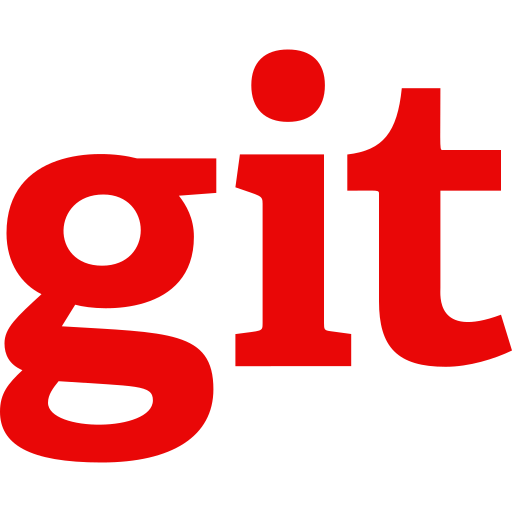

<h1 align="center">Hi 👋, I'm Eduardo Alvarez.</h1>
<h3 align="center">Junior Web Developer (Full-Stack) | React · Node.js · MongoDB</h3>
<h4 align="center">Remote / Hybrid in Buenos Aires(Argentina) and/or Florianopolis(Brazil).</h4> 

  

<h3 align="left">About me:</h3>

🎓 React Developer. Programa ENTRA 21 - Blusoft/SENAI (Feb 2024).

🔭 Eagerly looking for my first role as a Junior Web Developer.

🛠️ Building portfolio projects with React, Node.js & MongoDB.
 

<h3 align="left">Connect with me:</h3>

<h3 align="left">Languages and Tools:</h3>

  
            
                   	 ![CSS3] 

 

&nbsp;

